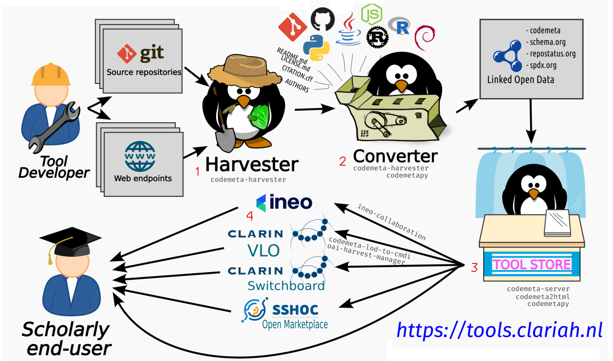

## Introduction

* **Objective:** Help researchers **F**ind and identify tools suitable for their research.
    * Users must be able to make an informed enough judgement
* **Problem:** Many software catalogues exist, but:
    * Information is often outdated
        * manually curated once, version information, provenance, broken links
    * Information is often incomplete
        * maintenance status, documentation
    * Information is duplicated and not aligned
        * multiple metadata schemes

## Introduction (2)

* We developed a pipeline for **automatic** software metadata harvesting.
* We **periodically** harvest software metadata **from the source**
* This is not another software catalogue system; we aim to feed data to
  various catalogues

## Bottom-up harvesting from the source (1)

{ height=40% }\

* Software metadata is kept at the source
    1. Metadata lives alongside the source code in a version controlled repository (e.g. git) and published in a forge (e.g. GitHub).
    2. (SaaS) metadata provided directly by web endpoints

**Advantages:** Full authorship with the developers, versioned, no duplication, no intermediaries

## Bottom-up harvesting from the source (2)

{ height=40% }\

* A minimal manually-curated *source registry* contains all repositories/endpoints to harvest
* Our harvester periodically checks all of these.
* For each, it finds and collects various existing and heterogeneous software metadata schemes
    * Reuse what developers already use, avoid any duplication of metadata.
    * (e.g `pyproject.toml`, `project.json`, `pom.xml`, badges in `README.md`, `LICENSE`, `AUTHORS`)

## Bottom-up harvesting from the source (3)

{ height=70% }\

Many instances of metadata can be found!

## Metadata conversion to codemeta

* Existing heterogeneous software metadata schemes are converted into a uniform linked-open-data representation
    * CodeMeta and schema.org as our base vocabulary
    * Additional vocabularies on top (e.g. spdx, repostatus.org)
* The result of the conversion is a single `codemeta.json` file (JSON-LD)
    * May be committed back into the source repo

## Publishing in catalogues

**Use-case:** CLARIAH (114 source repositories, 34 web endpoints)

## Publishing in catalogues (1)

## Publishing in catalogues (2)

## Publishing in catalogues (3)

## Challenges

* Consolidating distinct vocabularies
* Extra domain-specific vocabulary
    * e.g. TaDiRaH for research activities
    * NWO Research Domains
    * Technology Readiness Level 
* Validation & Curation

## Validation & Curation (1)

* How to allow curation/collaboration?
    * Forges like GitHub have solid contributor mechanisms in-place
* How to assure metadata quality?
    * Harvested metadata is evaluated against a schema (SHACL) that tests
      metadata fields (completeness, accuracy).
    * The schema is made on the basis of carefully formulated
      *software metadata requirements*
    * The result of the evaluation is an automated compliance report
      and a compliance score on a 0-5 scale.
    * The report and score itself become part of the metadata.
    * Set a threshold for propagation to catalogues

## Validation & Curation (2): Metadata Requirements

## Validation & Curation (3): Validation report 

## Validation & Curation (4): Findings

* Human compliance is the biggest hurdle
* Hard to get developers to provide extra metadata
* Metadata compliance ranking in CLARIAH (114 tools): 

{ height=70% }\

## Questions?

